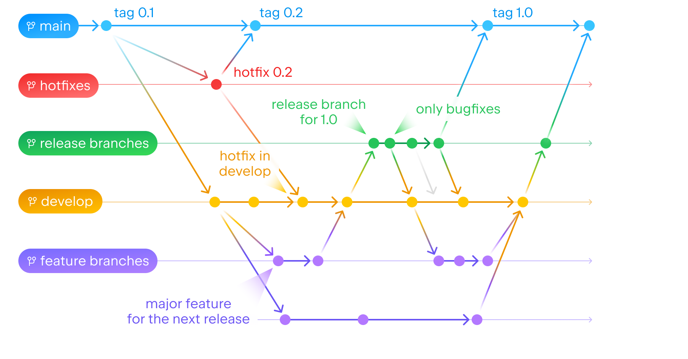

# Contributing

Процесс внесения изменений в проект SDDS Android

## Before commit
На каждом PR происходит прогон тестов и статических анализаторов. Влить PR не удастся без успешно пройденых тестов и валидных результатов
анализаторов. Поэтому перед коммитом рекомендуется запустить этот процесс локально, чтобы поберечь время и избежать повторного запуска пайплайна.
Для этого в корне проекта нужно запустить tasks:
```sh
./gradlew test
./gradlew detektAll
./gradlew spotlessApplyAll
```

Также допускается запуск tasks для конкретного модуля:
```sh
./gradlew :sds-core:uikit:testDebugUnitTest
./gradlew :sds-core:uikit:detekt
./gradlew :sds-core:uikit:spotlessApply
```

## Issues

Если в процессе разработки выяснилось, что необходимо сделать какое-то изменение в будущем или встретился какой-либо баг,
то требуется создать новый [Issue](https://github.com/salute-developers/plasma/issues), добавить в нём описание и требования,
а также отметить данный участок кода комментарием с ключевым словом `TODO` и ссылкой на issue:
```kotlin
// TODO: https://github.com/salute-developers/plasma/issues/438
```

## Commit

Мы используем Conventional Commits (<https://www.conventionalcommits.org/>). Git commit message должен быть на английском языке.
Для удобства генерации release notes каждый коммит должен относиться к одному target и указывать его в скобках как скоуп.
Target -  это то, что мы собираем и выпускаем в релиз (:sdds-core:sandbox, :sdds-core:uikit, :sdds-core:plugin_theme_builder и т.д.).
Допустимые скоупы:
- sdds-acore/uikit
- sdds-acore/uikit-compose
- sdds-acore/theme-builder
- sdds-acore/sandbox
- sdds-android/build-system (не target, но нужно указывать, если есть изменения в build-system)
- sdds-alibs/${libName} - где libName - это библиотеки для вертикалей

Примеры коммитов:

```sh
git commit -m "feat(sdds-acore/uikit): Component Button was added"
git commit -m "fix(sdds-acore/sandbox): Buttons screen was fixed"
```

Использование Conventional Commits обязательно:

-   `fix` - если вносится исправление в существующую функциональность;
-   `feat` - если в кодовую базу добавляется новая функциональность;
-   `docs` - если вносится изменение в контент документации;
-   `chore` - если вносимые изменения не относятся ни к кодовой базе пакетов, ни к документации;
-   `build` - сборка пакетов и утилит;
-   `test` - для добавления / обновления тестов и снапшотов;
-   `ci` - для всех коммитов в папке .github

## Pull request

-   Создаем PR в ветку `develop`, дожидаемся успешного завершения работы CI.
-   Дописываем в главный коммент описание того, что было сделано и для чего.
-   Дожидаемся аппрува от всех ревьюеров ПРа.
-   Мержим ПР.

## Релизный процесс
- Разработка ведется в `feature/` ветках, которые отводятся из ветки `develop`
- Каждые 2 недели `feature-freeze`, когда отводится ветка `release/`, а версия `develop` поднимается
- Ветка `release/` стабилизируется (вливаются только исправления дефектов) 2 недели
- По окончанию стабилизации `release/` ветки происходит `code-freeze` и публикация релиза
- Во время `code-freeze`, пока ветка `release/` вливается в `develop` и `main`, запрещено вливать любой код
- При необходимости из `main` ветки может создаваться ветка `hotfix`, которая потом тоже вливается в `main` и `develop`


